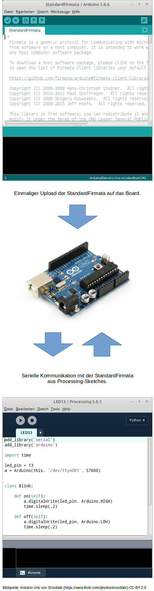

# Firmata

Der einfachste Zugang zur Programmierung des Arduino mit Python erfolgt mithilfe der so genannten StandardFirmata. Dabei handelt es sich um eine spezielle Version der [Firmata](https://github.com/firmata/protocol)
für Arduino-Boards. Wir setzen sie ein, um von Processing aus unser Arduino-Board steuern zu können - mit Python! 

Die technischen Zusammenhänge sowie Aufbau und Installation werden im folgenden erklärt.

## Hello World!

Nachdem wir mit der Arduino-IDE "Hello World!" geblinkt haben, wollen wir einen ähnlich einfachen Versuch aufbauen: Wir schreiben einen Processing-Sketch, der eine LED blinken lässt!

## Vorbereitung

Damit wir mit Processing das Arduino-Board steuern können, müssen wir einige vorbereitende Schritte erledigen:

### Mit der Arduino-IDE

1. Installation der StandardFirmata auf dem Arduino Uno.

### Mit der Processing-IDE

1. Installation und Import der Bibliothek *Arduino (Firmata)*.
2. Import der Bibliothek *serial*
3. Erstellung einer Klasse *LED*

