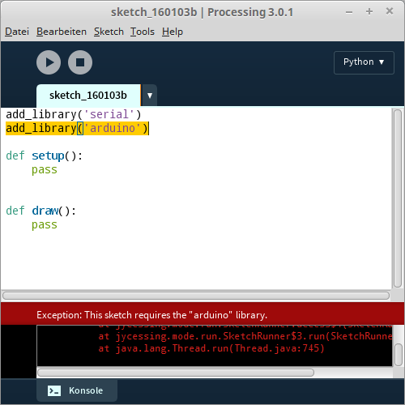

# Firmata

Der einfachste Zugang zur Programmierung des Arduino mit Python erfolgt mithilfe der so genannten StandardFirmata. Dabei handelt es sich um eine spezielle Version der [Firmata](https://github.com/firmata/protocol)
für Arduino-Boards. Wir setzen sie ein, um von Processing aus unser Arduino-Board steuern zu können - mit Python! Dabei ist eine Sache für das Verständnis des komplexen Aufbaus am Wichtigsten: 

Die StandardFirmate wird **einmalig** auf das Arduino-Board geladen. Anschließend erfolgt die Programmierung in der Processing-IDE nur noch in Python!

Das folgende Schaubild zeigt diesen Sachverhalt.


**Abbildung**: Grundsätzliche Arbeitsweise mit der StandardFirmata

Schreiten wir zu Tat und stellen die notwendigen Bedingungen für die Weiterarbeit her!

## Hello World! Again.

Nachdem wir mit der Arduino-IDE "Hello World!" geblinkt haben, wollen wir einen ähnlich einfachen Versuch aufbauen: Wir schreiben einen Processing-Sketch, der eine LED blinken lässt!

### Vorbereitung

Damit wir mit Processing das Arduino-Board steuern können, müssen wir einige vorbereitende Schritte erledigen:

### Mit der Arduino-IDE

1. Installation der StandardFirmata auf dem Arduino Uno.

### Mit der Processing-IDE

1. Installation und Import der Bibliothek *Arduino (Firmata)*.
2. Import der Bibliothek *serial*
3. Erstellung des Hauptprogramms und einer Klasse *LED*

## Installation der StandardFirmata

Dieser Schritt ist denkbar einfach zu erledigen, da die StandardFirmata wie jeder andere Arduino-Sketch auf das Board geladen wird. Zunächst muss die StandardFirmata in der Arduino-IDE aus den Beispielen geöffnet werden (Menü Datei -> Beispiele -> Firmata -> StandardFirmata).

Mit dem Upload-Pfeil unter der Menüleiste der Arduino-IDE wird anschließend das Programm kompiliert und auf den Microcontroller hochgeladen. Geht alles korrekt vonstatten, steht folglich eine Softwareschnittstelle auf dem Arduino zur Verfügung, die sich aus Processing heraus ansprechen lässt.

Falls die On-Board-LED infolge des vorangegangenen Beispiels noch geblinkt haben sollte, hat sie nach diesem Vorgang damit aufgehört, da die StandardFirmata das Blink-Programm überschrieben hat. Dass die StandardFirmata nun in einer Endlosschleife auf dem Arduino läuft, ist von außen nicht zu erkennen.

## Installation und Import der Bibliothek *Arduino (Firmata)*

In der Processing-IDE erstellen wir nun ein erstes Programm:

```python
add_library('serial')
add_library('arduino')

def setup():
    pass
    
def draw():
    pass

```

Lassen wir es laufen, könnte es sich mit einem Fehler melden: 



Es fehlt eine Bibliothek, die die Kommunikation mit der StandardFirmata auf dem Board ermöglicht. Wir installieren sie also nach (vgl. [Bibliotheken verwenden](../Themen/bibliotheken-verwenden.md)
). Die Bibliothek *serial* ist standardmäßig installiert. Sie dient der allgemeinen seriellen Kommunikation, worauf später noch genauer eingegangen werden soll.

## Instanziierung des Arduino-Objekts

```python
add_library('serial')
add_library('arduino')

def setup():
    a = Arduino(this, '/dev/ttyACM1', 57600)
    
def draw():
    pass
```

Die Arduino-Bibliothek bringt eine Klasse *Arduino* mit, von der wir hier ein Objekt erzeugen. Der Konstruktor empfängt den Kontext des aktuellen Programms sowie den Namen der seriellen Schnittstelle, an der das Arduino-Board angeschlossen ist. Als dritten Parameter übergeben wir die Baud-Rate. Diese **muss** für die Kommunikation mit der StandardFirmata 57600 betragen! Mehr zur Baud-Rate später, wenn wir uns genauer mit serieller Kommunikation beschäftigen.

Die Ausführung des aktuellen Programms bewirkt nicht viel: Es sollte sich die Processing-Leinwand öffnen, und auf dem Board flackern kurz die LEDs *TX* und *RX*. Sie zeigen an, dass eine serielle Übertragung stattfindet. *RX* steht für empfangen (receive), *TX* für senden (transmit).

## Lampe an!

Nun wollen wir den Code schreiben, der unsere LED auf Pin 13 einschaltet!

```python
add_library('serial')
add_library('arduino')

# Auch hier wird die On-Board-LED auf Pin 13 verwendet
led = 13

def setup():
    # Erzeugung eines Arduino-Objekts
    a = Arduino(this, '/dev/ttyACM1', 57600)
    # Pin 13 wird als Ausgang definiert
    a.pinMode(led, Arduino.OUTPUT)
    # Die LED wird angeschaltet
    a.digitalWrite(led, Arduino.HIGH)
    
def draw():
    pass
```


