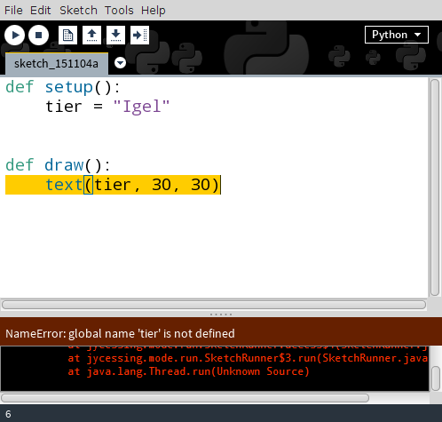

## Variablen

Um Daten in einem Programm verarbeiten zu können, muss man sie zunächst speichern können. Als Speicherorte dienen *Variablen*, denen Werte zugewiesen werden.

```{.python}
tier = "Dackel"
```

Auf der linken Seite des Gleichheitszeichens steht der Variablennamen, auch *Bezeichner* genannt, rechts davon der Wert. Hier wird der Variablen `tier` der String `"Dackel"` zugewiesen. Damit wird die Variable zugleich *deklariert* und *initialisiert*, also mit einem Ausgangswert belegt.

Bezeichner sollten sinnvoll und selbstdokumentierend gewählt werden. Das heißt, dass der Name der Variablen Auskunft über den Sinn und die Verwendung des Werts geben sollte[^4]. In Python können alle Datentypen Variablen zugewiesen werden.


### Geltungsbereich von Variablen

Der Ort, wo eine Variable deklariert wurde, entscheidet über ihren Geltungsbereich. Man unterscheidet *lokale* und *globale* Variablen.

Das folgende Beispiel zeigt die Definition einer lokalen Variablen:



In der Funktion `setup()` wird der Variablen `tier` der String `"Igel"` zugewiesen. In der Funktion `draw()` wird nun versucht, auf diese Variable zuzugreifen. Bei Ausführung des Programms wird ein Fehler geworfen, der Aufschluss über den Geltungsbereich der Variablen gibt: 

        NameError: global name 'tier' is not defined
        
Die Variable `tier` ist nicht bekannt


[^4]: Vgl. zur Qual bei der Suche nach dem richtigen Bezeichner Passig (2013)