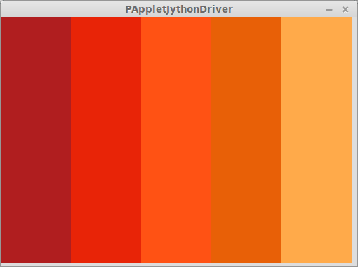

## Listen und Schleifen

Der Datentyp *list* wird im Kapitel [Datentypen](../Programmiergrundlagen/2-datentypen.html) schon vorgestellt. Im folgenden Abschnitt sollen die Möglichkeiten von Listen für Processing behandelt werden.

### Beispiel: Farbthema - Werte einer Liste auslesen

Inspiriert vom Farbentool [Adobe Color CC](https://color.adobe.com/de/create/color-wheel/) wollen wir analog ein Farbthema mit Processing visualisieren.


```python
# Farbthema "Backstein" von claudia
# https://color.adobe.com/de/Backstein-color-theme-7211262/?showPublished=true

def setup():
    size(500, 350)
    noStroke()
    # Die hexadezimalen Farbwerte von "Backstein"
    # als Strings in einer Liste.
    # Siehe hierzu das Beispiel in der IDE
    # "Python Mode Differences -> LiteralColors"
    farben = ["#B01E1F", 
            "#E82407", 
            "#FF5214", 
            "#E86007", 
            "#FFAA4A"]
    
    anzahl_farben = len(farben)
    
    # x-Koordinate für farbige Rechtecke
    rect_pos_x = 0
    
    # Die Breite und damit die gleichmäßige Verteilung
    # der Rechtecke wird aus der Breite der Leinwand
    # und der Anzahl der Farben errechnet.
    breite = width / anzahl_farben
    
    # Mit einer Schleife iterieren wir über die Liste.
    # Bei jedem Durchlauf enthält farbe einen anderen
    # Wert aus der Liste.
    for farbe in farben:
        # Füllfarbe ändern
        fill(farbe)
        # Rechteck zeichnen
        rect(rect_pos_x, 0, breite, height)
        # Position fürs nächste Rechteck errechnen
        rect_pos_x += breite
```

Das Ergebnis ähnelt start der Ansicht aus dem [Browsertool](https://color.adobe.com/de/Backstein-color-theme-7211262/?showPublished=true)
.



### Beispiel: Eine Liste mit zufälligen Werten füllen

In der Datenverarbeitung muss man häufig eine Reihe von Werten zwischenspeichern, um später mit ihnen weiterzuarbeiten. Wir konstruieren einen solchen Fall mit der Auslosung der Lottozahlen:

```python
def setup():

    # Leere Liste erzeugen
    lottozahlen = []
    
    # 6 Zufallszahlen ...
    for i in range(6):
        
        # ... aus 49 erzeugen
        zufallszahl = random(0,49)
        aufgerundet = ceil(zufallszahl)
        
        # Bei jedem Durchlauf die neue Zahl
        # an die Liste dranhängen (append)
        lottozahlen.append(aufgerundet)
    
    # Am Ende die Liste sortieren    
    lottozahlen.sort()
    print(lottozahlen)
```

Neu sind hier zwei *Methoden* des Listenobjekts `lottozahlen`. `append()` und `sort()` sind **Methoden der Klasse *list*** und werden daher mit dem *Punktoperator* direkt mit dem Objekt verbunden. Weitere Details zu diesem Konzept finden sich im Kapitel [Objektorientierte Programmierung](../Programmiergrundlagen/10-oop.html). Die Referenz von
[Processing.py](http://py.processing.org/reference/)
erklärt weitere Methoden des Listenobjekts und sollte in diesem Zusammenhang studiert werden.

### Beispiel: Koordinaten speichern

Im Kapitel [Datentypen](../Programmiergrundlagen/2-datentypen.html) wird eine besondere Eigenschaft von Listen genannt, die sehr nützlich für die Arbeit mit Positionskoordinaten in Processing ist: Listen können wiederum Listen speichern und sind damit bestens geeignet, eine Matrix abzubilden.

Dazu ist es zunächst notwendig, dass wir uns ansehen, wie eine einfache 3x3-Matrix mit einer Python-Liste aufgebaut ist:

```python
matrix = [[1,2,3],[4,5,6],[7,8,9]]

# Hilfreiche alternative Notationsweise:
matrix = [ [1,2,3],
           [4,5,6],
           [7,8,9] ]
```

Die äußeren eckigen Klammern umfassen die äußere Liste. Darin sind drei Elemente enthalten, die jeweils eine Liste repräsentieren. Wir können die Elemente der äußeren Liste folgendermaßen ansprechen:

```python
print(matrix[1]) # Ausgabe: [4, 5, 6]
```

Durch einen zweiten Indexoperator können wir nun auch auf die Elemente der inneren Listen zugreifen:

```python
print(matrix[1][2]) # Ausgabe: 6
```

Immer dran denken, dass der Index in Listen bei `0` beginnt!

Das Speichern von Werten des Koordinatensystems folgt diesem Ansatz. Wir schreiben ein Programm, dass die Positionen von 100 Bällen zufällig generiert und in einer Liste speichert. Mit jedem Klick der Maus können wir einen Ball auf die Leinwand werfen. Mit dem Druck der Leertaste können wir die Leinwand löschen und dann wieder Bälle auf die Leinwand werfen - **an denselben Koordinaten wie zuvor!** Letzteres ist ausschlaggebend: Zufällige Koordinaten werden einmal generiert und dann immer wieder verwendet.

```python
# Global verfügbare Liste für die Koordinaten
koordinaten = []

# Zähler
counter = 0

def setup():
    size(400, 400)
    fill(255, 0, 0)
    background(255)

    # Hundert Werte generieren
    for i in range(100):

        random_x = random(width)
        random_y = random(height)

        # Jedes x/y-Paar ist eine Liste mit zwei
        # Werten, die der äußeren Liste angehängt wird
        koordinaten.append([random_x, random_y])

def draw():
    pass

# Bei jedem Klick
def mouseClicked():
    global counter, koordinaten
    
    # Mithilfe des Counters auf die Koordinaten zugreifen und
    # einen Kreis zeichnen
    ellipse(koordinaten[counter][0], koordinaten[counter][1], 10, 10)

    # Solange noch Koordinaten in der Liste sind, 
    # die nicht ausgelesen wurden, den Zähler erhöhen
    if counter < len(koordinaten):
        counter += 1

# Mit Leertaste die Leinwand löschen...
def keyPressed():
    global counter
    if key == " ":
        # ... und den Zähler auf Null setzen
        background(255)
        counter = 0

```

Zum Auslesen der Koordinatenliste haben wir hier keine Schleife verwendet, sondern mit einem Zähler gearbeitet, der *global* im ganzen Programm verfügbar ist. Dieses Konzept ist bewährt und wird häufig zum *Austausch von Zuständen* unter Funktionen und Methoden angewandt.

### Lernvorschläge

* Wandele das Programm "Farbthema" so ab, dass es durch Tasten- oder Mausinteraktion immer neue, zufällige Farbthemen erzeugt.
* Schreibe ein Programm, das die Bewegung der Maus über die Leinwand speichert. Sobald die linke Maustaste gedrückt wird, soll der Pfad der Maus sichtbar werden.
* Suche im Internet ein Zitat, das dir gefällt. Speichere die einzelnen Wörter in einer Liste und animiere sie anschließend. Dabei kannst Du Maus- und Tasteninteraktion, Größen- und Schriftartveränderung und farbliche Spielereien einbauen.
* Baue eine Diashow mit Bildern, die du in einer Liste speicherst.
* Realisiere einen Button mit vier Bildern, die je nach Mausaktion angezeigt werden:
    * keine Interaktion: erstes Bild
    * mouseOver: zweites Bild
    * mouseClicked: drittes Bild
    * mouseReleased: viertes Bild